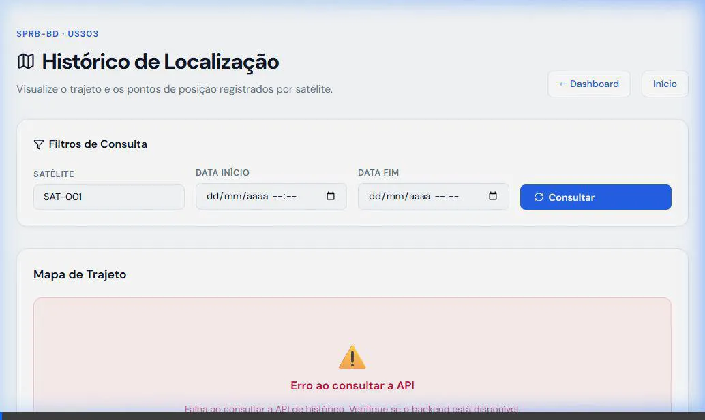

# Demonstração: US303 — Visualizar histórico de localização em mapa

Este documento tem como objetivo validar e registrar a implementação da **US303**, garantindo que todos os critérios de aceite (CA) foram atendidos conforme solicitado. 

## 🗺️ Visualização do Mapa com Dados (CA01)

No vídeo abaixo, é possível observar o fluxo completo:
1. O usuário informa o identificador do satélite.
2. Ao clicar em **Consultar**, a interface carrega os pontos do histórico.
3. O componente do Leaflet renderiza os marcadores de forma visual (ponto inicial, final e intermediários), conectados por uma trilha (polyline).
4. Os controles de *zoom* e *pan* estão operantes, e os dados tabulares são exibidos logo abaixo do mapa.

## ⚠️ Comportamento de Erro / Sem Dados (CA02 e CA03)

O sistema também está preparado para lidar com ausência de dados ou falhas de conectividade com a API, preservando a consistência da UI e informando o usuário de maneira clara.

---

### Resumo dos Critérios Validados
- **CA01 — Exibição com dados:** O mapa renderiza os pontos de histórico e a trilha com cores e legenda claras.
- **CA02 — Sem dados:** A interface exibe um painel informativo quando a busca não retorna resultados.
- **CA03 — Falha de API:** Se o backend estiver fora do ar, o componente captura o erro e avisa o usuário de forma amigável (sem "quebrar" a tela).

> **Nota para testes locais:**
> Para testar localmente com dados reais, certifique-se de que o Docker esteja rodando e inicie o backend com `docker compose up -d` seguido de `uv run uvicorn app.main:app`.
