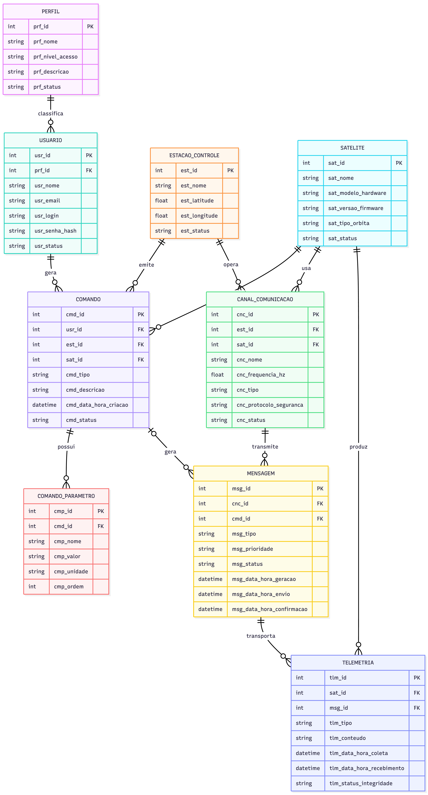
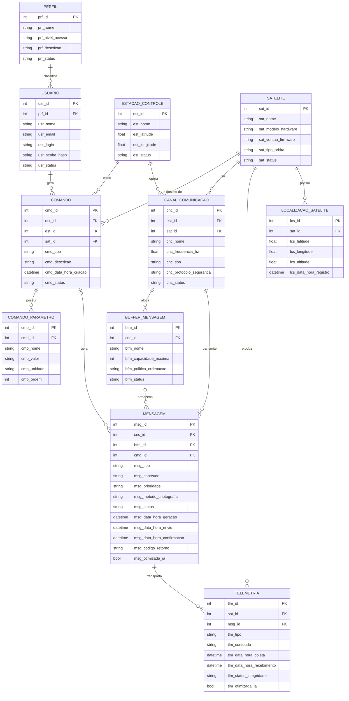

# README — US120 Elaborar MER

## TS#01 — Componentes de Software e Hardware de Dispositivos Satelitais

Este documento consolida o **Modelo Entidade-Relacionamento (MER)** refinado para a **US120 — Elaborar MER**, com foco no **Segmento Espacial** e no **Segmento de Controle** do sistema de posicionamento, considerando a visão de negócio da sprint e mantendo legibilidade, coerência e aderência à normalização adequada.

---

## Objetivo deste README

Este README tem como finalidade:

- documentar as **entidades** do modelo e sua necessidade para o negócio;
- apresentar o **dicionário de dados** em formato legível;
- registrar os **relacionamentos e cardinalidades**, incluindo obrigatoriedades e opcionalidades;
- descrever os **fluxos esperados de operação**;
- explicitar a **adequação do modelo à forma normal**;
- registrar **observações importantes antes da passagem para o modelo lógico**.

---

## 1. Escopo do modelo

O modelo cobre, em nível conceitual refinado:

- usuários e perfis de acesso;
- estação de controle terrestre;
- satélites;
- canais de comunicação;
- comandos e seus parâmetros;
- mensagens e buffers;
- telemetria de retorno;
- histórico de localização do satélite.

O modelo foi mantido **legível e orientado à visão de negócio**, evitando superdimensionamento precoce do MER.

---

## 2. Convenções adotadas

- **Entidades** em maiúsculas e no singular.
- **Atributos** com **trigramação**.
- **PK** = chave primária.
- **FK** = chave estrangeira.
- Cardinalidades em notação `1:N`.
- Campos genéricos como `msg_conteudo` e `tlm_conteudo` foram mantidos no nível conceitual para preservar simplicidade.

---

## Diagrama MER

Ver código Mermaid do diagrama

---

## 3. Entidades do modelo e sua necessidade no negócio

| Entidade | Necessidade no negócio | Observação sobre normalização |
|---|---|---|
| `PERFIL` | Classifica os usuários por nível de acesso | Evita manter perfil como texto repetido em `USUARIO` |
| `USUARIO` | Representa quem opera a central de comandos | Mantém dados de autenticação e vínculo com perfil |
| `ESTACAO_CONTROLE` | Representa o ponto de operação do segmento terrestre | Centraliza emissão e recebimento de dados |
| `SATELITE` | Representa o ativo espacial controlado/monitorado | Mantém atributos estáveis do satélite |
| `CANAL_COMUNICACAO` | Representa o vínculo operacional de comunicação entre estação e satélite | Evita relacionamento N:N direto entre estação e satélite |
| `COMANDO` | Representa a instrução emitida por um usuário para um satélite | Mantém origem terrestre e destino espacial |
| `COMANDO_PARAMETRO` | Representa os parâmetros específicos de cada comando | Evita listas em atributos e melhora a 3FN |
| `BUFFER_MENSAGEM` | Representa fila temporária de mensagens | Mantém ordenação e retenção separadas das mensagens |
| `MENSAGEM` | Representa o envelope de transporte de comandos, retornos e telemetria | Centraliza o fluxo de transmissão |
| `TELEMETRIA` | Representa os dados retornados do satélite | Separa dado de negócio do envelope de transporte |
| `LOCALIZACAO_SATELITE` | Representa o histórico posicional do satélite | Evita armazenar localização mutável em `SATELITE` |

---

## 4. Relacionamentos e cardinalidades

| Relacionamento | Cardinalidade | Obrigatório ou opcional | Explicação objetiva |
|---|---|---|---|
| `PERFIL` — `USUARIO` | `1:N` | obrigatório para `USUARIO` | Cada usuário possui um único perfil; um perfil pode classificar vários usuários |
| `USUARIO` — `COMANDO` | `1:N` | obrigatório para `COMANDO` | Cada comando é gerado por um usuário; um usuário pode gerar vários comandos |
| `ESTACAO_CONTROLE` — `COMANDO` | `1:N` | obrigatório para `COMANDO` | Cada comando é emitido por uma estação; uma estação pode emitir vários comandos |
| `SATELITE` — `COMANDO` | `1:N` | obrigatório para `COMANDO` | Cada comando tem um satélite de destino; um satélite pode receber vários comandos |
| `COMANDO` — `COMANDO_PARAMETRO` | `1:N` | opcional para `COMANDO` | Um comando pode ter zero ou vários parâmetros |
| `ESTACAO_CONTROLE` — `CANAL_COMUNICACAO` | `1:N` | obrigatório para `CANAL_COMUNICACAO` | Cada canal pertence a uma estação; uma estação pode operar vários canais |
| `SATELITE` — `CANAL_COMUNICACAO` | `1:N` | obrigatório para `CANAL_COMUNICACAO` | Cada canal está associado a um satélite; um satélite pode usar vários canais |
| `CANAL_COMUNICACAO` — `BUFFER_MENSAGEM` | `1:N` | obrigatório para `BUFFER_MENSAGEM` | Cada buffer pertence a um canal; um canal pode ter vários buffers |
| `BUFFER_MENSAGEM` — `MENSAGEM` | `0:1` para `MENSAGEM`, `1:N` para `BUFFER_MENSAGEM` | opcional para `MENSAGEM` | Nem toda mensagem precisa passar por buffer |
| `CANAL_COMUNICACAO` — `MENSAGEM` | `1:N` | obrigatório para `MENSAGEM` | Cada mensagem usa um canal; um canal pode transmitir várias mensagens |
| `COMANDO` — `MENSAGEM` | `0:1` para `MENSAGEM`, `1:N` para `COMANDO` | opcional para `MENSAGEM` | Nem toda mensagem deriva de comando; uma mensagem pode ser telemetria ou retorno |
| `SATELITE` — `TELEMETRIA` | `1:N` | obrigatório para `TELEMETRIA` | Cada telemetria vem de um satélite; um satélite pode gerar várias telemetrias |
| `MENSAGEM` — `TELEMETRIA` | `1:N` | obrigatório para `TELEMETRIA` | Cada telemetria é transportada por uma mensagem |
| `SATELITE` — `LOCALIZACAO_SATELITE` | `1:N` | obrigatório para `LOCALIZACAO_SATELITE` | Cada registro de localização pertence a um satélite; um satélite pode ter vários registros históricos |

---

## 5. Fluxos esperados de operação

### 5.1 Fluxo de envio de comando
`USUARIO → COMANDO → COMANDO_PARAMETRO → MENSAGEM → BUFFER_MENSAGEM (opcional) → CANAL_COMUNICACAO → SATELITE`

**Descrição objetiva:**
1. Um usuário autenticado gera um comando.
2. O comando é emitido por uma estação de controle.
3. Os parâmetros do comando são registrados separadamente.
4. O comando é encapsulado em uma mensagem.
5. A mensagem pode ou não passar por um buffer.
6. A mensagem é transmitida por um canal de comunicação.
7. O satélite recebe e processa o comando.

---

### 5.2 Fluxo de retorno da telemetria
`SATELITE → TELEMETRIA → MENSAGEM → CANAL_COMUNICACAO → ESTACAO_CONTROLE → USUARIO`

**Descrição objetiva:**
1. O satélite gera dados de telemetria.
2. A telemetria é encapsulada em uma mensagem de retorno.
3. A mensagem é transmitida pelo canal.
4. A estação de controle recebe, valida e persiste o dado.
5. O usuário consulta as informações retornadas pela central.

---

### 5.3 Fluxo de atualização de localização
`SATELITE → TELEMETRIA/MENSAGEM → ESTACAO_CONTROLE → LOCALIZACAO_SATELITE`

**Descrição objetiva:**
1. O satélite informa sua posição por telemetria.
2. A estação recebe o dado.
3. O sistema registra o histórico em `LOCALIZACAO_SATELITE`.

---

## 6. Dicionário de dados

### 6.1 PERFIL

| Atributo | Chave | Descrição | Tipo conceitual | Obrigatório | Exemplo | Observação |
|---|---|---|---|---|---|---|
| `prf_id` | PK | Identificador único do perfil | Inteiro | Sim | `1` | Chave primária |
| `prf_nome` |  | Nome do perfil | Texto | Sim | `OPERADOR` | Deve ser semanticamente único |
| `prf_nivel_acesso` |  | Nível hierárquico do perfil | Texto | Sim | `MEDIO` | Classifica criticidade/amplitude |
| `prf_descricao` |  | Descrição do papel do perfil | Texto | Não | `Perfil responsável por envio de comandos` | Útil para governança |
| `prf_status` |  | Estado do perfil | Texto | Sim | `ATIVO` | Ex.: ativo, inativo |

---

### 6.2 USUARIO

| Atributo | Chave | Descrição | Tipo conceitual | Obrigatório | Exemplo | Observação |
|---|---|---|---|---|---|---|
| `usr_id` | PK | Identificador único do usuário | Inteiro | Sim | `101` | Chave primária |
| `prf_id` | FK | Perfil associado ao usuário | Inteiro | Sim | `1` | FK para `PERFIL(prf_id)` |
| `usr_nome` |  | Nome do usuário | Texto | Sim | `João Silva` | Identificação humana |
| `usr_email` |  | E-mail do usuário | Texto | Sim | `joao.silva@empresa.com` | Idealmente único |
| `usr_login` |  | Login de autenticação | Texto | Sim | `operador01` | Idealmente único |
| `usr_senha_hash` |  | Hash da senha do usuário | Texto | Sim | `a94a8fe5...` | Não armazena senha pura |
| `usr_status` |  | Estado do usuário | Texto | Sim | `ATIVO` | Ex.: ativo, bloqueado |

---

### 6.3 ESTACAO_CONTROLE

| Atributo | Chave | Descrição | Tipo conceitual | Obrigatório | Exemplo | Observação |
|---|---|---|---|---|---|---|
| `est_id` | PK | Identificador único da estação | Inteiro | Sim | `10` | Chave primária |
| `est_nome` |  | Nome da estação | Texto | Sim | `GS_BRASIL_01` | Identificação operacional |
| `est_latitude` |  | Latitude da estação | Número real | Sim | `-23.214` | Localização geográfica |
| `est_longitude` |  | Longitude da estação | Número real | Sim | `-45.871` | Localização geográfica |
| `est_status` |  | Estado operacional da estação | Texto | Sim | `ATIVA` | Ex.: ativa, manutenção |

---

### 6.4 SATELITE

| Atributo | Chave | Descrição | Tipo conceitual | Obrigatório | Exemplo | Observação |
|---|---|---|---|---|---|---|
| `sat_id` | PK | Identificador único do satélite | Inteiro | Sim | `20` | Chave primária |
| `sat_nome` |  | Nome do satélite | Texto | Sim | `SAT_BR_01` | Identificação operacional |
| `sat_modelo_hardware` |  | Modelo/plataforma de hardware | Texto | Sim | `PLATAFORMA_XYZ` | Controle de configuração física |
| `sat_versao_firmware` |  | Versão do firmware embarcado | Texto | Sim | `v2.3.1` | Controle de configuração lógica |
| `sat_tipo_orbita` |  | Tipo de órbita | Texto | Sim | `MEO` | Ex.: MEO, GEO, IGSO |
| `sat_status` |  | Estado operacional do satélite | Texto | Sim | `OPERACIONAL` | Ex.: operacional, falha |

---

### 6.5 CANAL_COMUNICACAO

| Atributo | Chave | Descrição | Tipo conceitual | Obrigatório | Exemplo | Observação |
|---|---|---|---|---|---|---|
| `cnc_id` | PK | Identificador único do canal | Inteiro | Sim | `30` | Chave primária |
| `est_id` | FK | Estação que opera o canal | Inteiro | Sim | `10` | FK para `ESTACAO_CONTROLE(est_id)` |
| `sat_id` | FK | Satélite associado ao canal | Inteiro | Sim | `20` | FK para `SATELITE(sat_id)` |
| `cnc_nome` |  | Nome do canal | Texto | Sim | `CANAL_UPLINK_01` | Identificação operacional |
| `cnc_frequencia_hz` |  | Frequência de operação em hertz | Número real | Sim | `2250000000.0` | Frequência configurada |
| `cnc_tipo` |  | Tipo funcional do canal | Texto | Sim | `UPLINK` | Ex.: uplink, downlink |
| `cnc_protocolo_seguranca` |  | Protocolo de segurança do canal | Texto | Sim | `TLS_1_3` | Mantido como atributo conceitual |
| `cnc_status` |  | Estado atual do canal | Texto | Sim | `ATIVO` | Ex.: ativo, contingência |

---

### 6.6 COMANDO

| Atributo | Chave | Descrição | Tipo conceitual | Obrigatório | Exemplo | Observação |
|---|---|---|---|---|---|---|
| `cmd_id` | PK | Identificador único do comando | Inteiro | Sim | `100` | Chave primária |
| `usr_id` | FK | Usuário que gerou o comando | Inteiro | Sim | `101` | FK para `USUARIO(usr_id)` |
| `est_id` | FK | Estação que emitiu o comando | Inteiro | Sim | `10` | FK para `ESTACAO_CONTROLE(est_id)` |
| `sat_id` | FK | Satélite destino do comando | Inteiro | Sim | `20` | FK para `SATELITE(sat_id)` |
| `cmd_tipo` |  | Tipo funcional do comando | Texto | Sim | `AJUSTE_ATITUDE` | Ex.: alterar frequência, solicitar telemetria |
| `cmd_descricao` |  | Descrição textual do comando | Texto | Sim | `Comando para ajuste da atitude do satélite` | Detalha a intenção |
| `cmd_data_hora_criacao` |  | Data/hora de criação do comando | Data/hora | Sim | `2026-04-18 14:35:00` | Instante de geração |
| `cmd_status` |  | Estado do comando | Texto | Sim | `PENDENTE` | Ex.: pendente, enviado, executado |

---

### 6.7 COMANDO_PARAMETRO

| Atributo | Chave | Descrição | Tipo conceitual | Obrigatório | Exemplo | Observação |
|---|---|---|---|---|---|---|
| `cmp_id` | PK | Identificador único do parâmetro | Inteiro | Sim | `1001` | Chave primária |
| `cmd_id` | FK | Comando ao qual o parâmetro pertence | Inteiro | Sim | `100` | FK para `COMANDO(cmd_id)` |
| `cmp_nome` |  | Nome do parâmetro | Texto | Sim | `angulo_pitch` | Identifica o papel do parâmetro |
| `cmp_valor` |  | Valor do parâmetro | Texto | Sim | `2.5` | Mantido como texto por flexibilidade |
| `cmp_unidade` |  | Unidade de medida | Texto | Não | `grau` | Pode ser vazio para valores categóricos |
| `cmp_ordem` |  | Ordem lógica do parâmetro | Inteiro | Não | `1` | Útil quando a ordem importa |

---

### 6.8 BUFFER_MENSAGEM

| Atributo | Chave | Descrição | Tipo conceitual | Obrigatório | Exemplo | Observação |
|---|---|---|---|---|---|---|
| `bfm_id` | PK | Identificador único do buffer | Inteiro | Sim | `40` | Chave primária |
| `cnc_id` | FK | Canal associado ao buffer | Inteiro | Sim | `30` | FK para `CANAL_COMUNICACAO(cnc_id)` |
| `bfm_nome` |  | Nome do buffer | Texto | Não | `FILA_COMANDOS_CRITICOS` | Facilita leitura operacional |
| `bfm_capacidade_maxima` |  | Capacidade máxima do buffer | Inteiro | Sim | `1000` | Número máximo de mensagens |
| `bfm_politica_ordenacao` |  | Política de ordenação | Texto | Sim | `FIFO` | Ex.: FIFO, PRIORIDADE |
| `bfm_status` |  | Estado do buffer | Texto | Sim | `ATIVO` | Ex.: ativo, inativo |

---

### 6.9 MENSAGEM

| Atributo | Chave | Descrição | Tipo conceitual | Obrigatório | Exemplo | Observação |
|---|---|---|---|---|---|---|
| `msg_id` | PK | Identificador único da mensagem | Inteiro | Sim | `200` | Chave primária |
| `cnc_id` | FK | Canal usado para transportar a mensagem | Inteiro | Sim | `30` | FK para `CANAL_COMUNICACAO(cnc_id)` |
| `bfm_id` | FK | Buffer em que a mensagem pode ter sido armazenada | Inteiro | Não | `40` | FK opcional para `BUFFER_MENSAGEM(bfm_id)` |
| `cmd_id` | FK | Comando que originou a mensagem | Inteiro | Não | `100` | FK opcional para `COMANDO(cmd_id)` |
| `msg_tipo` |  | Tipo funcional da mensagem | Texto | Sim | `COMANDO` | Ex.: comando, telemetria, confirmação |
| `msg_conteudo` |  | Conteúdo transportado pela mensagem | Texto | Sim | `AJUSTE_ATITUDE` | Campo genérico no nível conceitual |
| `msg_prioridade` |  | Prioridade atribuída à mensagem | Texto | Sim | `ALTA` | Influencia fila e despacho |
| `msg_metodo_criptografia` |  | Método de criptografia aplicado | Texto | Sim | `AES_256` | Mantido como atributo conceitual |
| `msg_status` |  | Estado atual da mensagem | Texto | Sim | `ENVIADA` | Ex.: gerada, em fila, confirmada |
| `msg_data_hora_geracao` |  | Data/hora de geração | Data/hora | Sim | `2026-04-18 14:36:00` | Instante de criação |
| `msg_data_hora_envio` |  | Data/hora de envio | Data/hora | Não | `2026-04-18 14:36:10` | Só existe após transmissão |
| `msg_data_hora_confirmacao` |  | Data/hora de confirmação/retorno | Data/hora | Não | `2026-04-18 14:36:20` | Só existe após resposta |
| `msg_codigo_retorno` |  | Código ou resumo do resultado | Texto | Não | `SUCESSO` | Ex.: timeout, erro, sucesso |
| `msg_otimizada_ia` |  | Indicador de otimização por IA | Booleano | Sim | `true` | Marca uso de IA no fluxo |

---

### 6.10 TELEMETRIA

| Atributo | Chave | Descrição | Tipo conceitual | Obrigatório | Exemplo | Observação |
|---|---|---|---|---|---|---|
| `tlm_id` | PK | Identificador único da telemetria | Inteiro | Sim | `300` | Chave primária |
| `sat_id` | FK | Satélite que gerou a telemetria | Inteiro | Sim | `20` | FK para `SATELITE(sat_id)` |
| `msg_id` | FK | Mensagem que transportou a telemetria | Inteiro | Sim | `200` | FK para `MENSAGEM(msg_id)` |
| `tlm_tipo` |  | Tipo da telemetria retornada | Texto | Sim | `STATUS_SUBSISTEMA` | Ex.: energia, posicionamento |
| `tlm_conteudo` |  | Conteúdo informacional da telemetria | Texto | Sim | `temperatura=42;bateria=87` | Campo genérico no nível conceitual |
| `tlm_data_hora_coleta` |  | Data/hora de coleta no satélite | Data/hora | Sim | `2026-04-18 14:36:15` | Momento em que o dado foi gerado |
| `tlm_data_hora_recebimento` |  | Data/hora de recebimento na estação | Data/hora | Sim | `2026-04-18 14:36:20` | Permite medir latência |
| `tlm_status_integridade` |  | Situação de integridade do dado | Texto | Sim | `INTEGRA` | Ex.: íntegra, corrompida |
| `tlm_otimizada_ia` |  | Indicador de otimização por IA | Booleano | Sim | `false` | Marca uso de IA no retorno |

---

### 6.11 LOCALIZACAO_SATELITE

| Atributo | Chave | Descrição | Tipo conceitual | Obrigatório | Exemplo | Observação |
|---|---|---|---|---|---|---|
| `lcs_id` | PK | Identificador único do registro de localização | Inteiro | Sim | `500` | Chave primária |
| `sat_id` | FK | Satélite ao qual a localização pertence | Inteiro | Sim | `20` | FK para `SATELITE(sat_id)` |
| `lcs_latitude` |  | Latitude registrada do satélite | Número real | Sim | `-12.345` | Componente geográfica |
| `lcs_longitude` |  | Longitude registrada do satélite | Número real | Sim | `-45.678` | Componente geográfica |
| `lcs_altitude` |  | Altitude registrada do satélite | Número real | Sim | `20000.0` | Unidade deve ser padronizada no lógico |
| `lcs_data_hora_registro` |  | Data/hora do registro | Data/hora | Sim | `2026-04-18 14:36:20` | Mantém histórico temporal |

---

## 7. Observações importantes antes do modelo lógico

### 7.1 Sobre a forma normal
O modelo está adequado à **3FN no núcleo estruturado** das entidades e relacionamentos principais.

### 7.2 Campos genéricos
Os atributos abaixo permanecem genéricos no nível conceitual:
- `msg_conteudo`
- `tlm_conteudo`

Em uma etapa futura de modelo lógico, esses campos podem ser decompostos se houver necessidade de maior rigor de normalização, consulta estruturada ou regras de validação específicas.

### 7.3 Perfis e permissões
A entidade `PERFIL` foi separada de `USUARIO` para explicitar níveis de acesso e evitar redundância. Caso o sistema evolua para um controle mais fino de permissões, uma entidade futura como `PERFIL_PERMISSAO` poderá ser adicionada.

### 7.4 Opcionalidades relevantes
As duas opcionalidades mais importantes do modelo são:
- nem toda `MENSAGEM` precisa estar associada a um `COMANDO`;
- nem toda `MENSAGEM` precisa estar associada a um `BUFFER_MENSAGEM`.

---