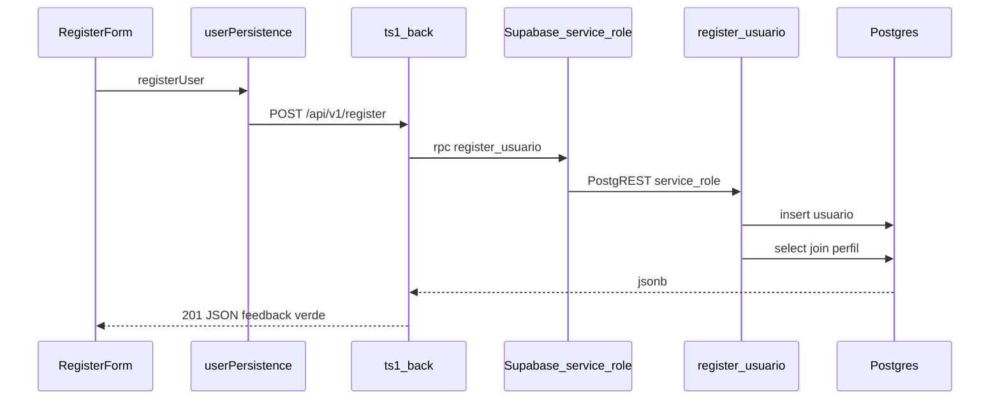

# US116 — Persistência de dados de usuário

Documento de entrega da **US116 — Persistência de Dados de Usuário (Banco de Dados)**.
Descreve o que foi implementado no `ts1-front` e o que foi configurado no Supabase para
que o cadastro pela tela `/register` passe a gravar e ler usuários reais no banco.

---

## Estado do Supabase (projeto TS#01)

**Os scripts em [`ts1/docs/sql/`](sql/) já foram aplicados** no projeto Supabase usado pelo time (SQL Editor do painel): `rls_rpc_register_usuario.sql` e, após validação do BFF, `revoke_anon_execute_register_usuario.sql`.

Os ficheiros `.sql` **permanecem no repositório** como **referência versionada** e para **novos ambientes** (outro projeto Supabase, fork, recuperação). No desenvolvimento normal do front/BFF **não é necessário executá-los de novo** — só se alguém criar uma base vazia nova.

---

## Resumo

O cadastro (`ts1/ts1-front`) envia os dados ao **BFF** [`ts1/ts1-back`](../ts1-back/README.md)
(`POST /api/v1/register`). O BFF valida, aplica rate limit e chama a RPC
**`register_usuario`** no Postgres com a **service role** (chave só no servidor). A
função aplica **bcrypt**, grava em `public.usuario` e devolve JSON com `perfil` (sem
`usr_senha_hash`). O browser **não** chama a RPC no Supabase diretamente.

**RLS:** `anon` não grava nem lê `usuario` pela API de tabela; só leitura controlada de
`perfil` ativo.

**SQL (referência + novos ambientes):** [`sql/rls_rpc_register_usuario.sql`](sql/rls_rpc_register_usuario.sql) e
[`sql/revoke_anon_execute_register_usuario.sql`](sql/revoke_anon_execute_register_usuario.sql) — **já executados no projeto atual** do time; ver secção *Estado do Supabase* acima.

---

## Arquivos adicionados ou alterados no repositório

| Caminho | Propósito |
|---------|-----------|
| `ts1/ts1-back/` | BFF FastAPI: cadastro com service role, CORS, rate limit, logging |
| `ts1/ts1-front/.env.example` | `VITE_API_BASE_URL` (obrigatório para cadastro); Supabase opcional no README |
| `ts1/ts1-front/.env.local` | Segredos locais — **não commitado** |
| `ts1/ts1-front/package.json` / `package-lock.json` | Inclui `@supabase/supabase-js` (reservado p.ex. login) |
| `ts1/ts1-front/src/lib/supabaseClient.ts` | Cliente anon (cadastro não usa) |
| `ts1/ts1-front/src/services/userPersistence.ts` | `registerUser` via `fetch` ao BFF |
| `ts1/ts1-front/src/features/Auth/RegisterForm.tsx` | Feedback de sucesso/erro na UI |
| `ts1/ts1-back/app/main.py` | Logging estruturado com `logging.basicConfig` |
| `ts1/ts1-back/app/routes/register.py` | Logging de info/warning/error em cada etapa do registro |
| `ts1/ts1-back/.env.example` | Documentação melhorada, sem URL real exposta |
| `ts1/docs/sql/revoke_anon_execute_register_usuario.sql` | Revoga RPC pública ao `anon` |

### O que cada peça faz

**`src/lib/supabaseClient.ts`**  
Cria uma única instância do cliente Supabase reaproveitada por toda a aplicação. Lança
erro imediato e claro se as envs não estiverem preenchidas (evita falhas silenciosas).

**`ts1/ts1-back`**  
`POST /api/v1/register` → cliente Supabase com `SUPABASE_SERVICE_ROLE_KEY` → RPC
`register_usuario`. Logging estruturado em cada etapa (solicitação, falha, sucesso).

**`src/services/userPersistence.ts`**  
`fetch` para `${VITE_API_BASE_URL}/api/v1/register` e parse da resposta JSON.

**`src/features/Auth/RegisterForm.tsx`**  
Estados de envio e mensagem com `created.perfil` retornado pelo BFF.

---

## O que foi feito no Supabase (fora do repositório)

O projeto Supabase do time já tinha o schema do MER
criado via painel. Três ajustes pontuais foram necessários para a US funcionar:

### 1. PKs sem auto-incremento → adicionar `IDENTITY`

As tabelas vieram com `prf_id`, `usr_id`, etc. como `int4 NOT NULL` mas **sem sequence**
nem default. Resultado prático: qualquer `insert` sem informar o ID manualmente falhava
com `null value in column "prf_id" violates not-null constraint`.

Como o código do front (e qualquer outra camada futura) não deve inventar IDs, as PKs
foram convertidas para `GENERATED BY DEFAULT AS IDENTITY`:

```sql
alter table public.perfil           alter column prf_id add generated by default as identity;
alter table public.usuario          alter column usr_id add generated by default as identity;
alter table public.estacao_controle alter column est_id add generated by default as identity;
alter table public.satelite         alter column sat_id add generated by default as identity;
alter table public.canal_comunicacao alter column cnc_id add generated by default as identity;
alter table public.comando          alter column cmd_id add generated by default as identity;
alter table public.comando_parametro alter column cmp_id add generated by default as identity;
alter table public.mensagem         alter column msg_id add generated by default as identity;
alter table public.telemetria       alter column tlm_id add generated by default as identity;
```

A escolha por `IDENTITY` (padrão SQL moderno) em vez de `SERIAL` segue a recomendação
oficial do PostgreSQL 10+.

### 2. Seed mínimo em `public.perfil`

A tabela estava vazia. Os três perfis **devem usar o mesmo `prf_nome` que o front envia em
`accessLevel`**: `admin`, `user`, `manager` (rótulos em português na UI são só do `<select>`).

```sql
insert into public.perfil (prf_nome, prf_nivel_acesso, prf_descricao, prf_status)
values
  ('admin',  'ALTO',  'Administrador do sistema',              'ATIVO'),
  ('user',   'BAIXO', 'Usuário operacional',                   'ATIVO'),
  ('manager','MEDIO', 'Gerente com permissões intermediárias', 'ATIVO');
```

### 3. Endurecimento: RLS + RPC `register_usuario` (substitui RLS desligada no MVP)

O MVP inicial desligava RLS em `perfil` e `usuario`, o que expunha as tabelas a qualquer
cliente com a `anon key`. A mitigação versionada está em
[`sql/rls_rpc_register_usuario.sql`](sql/rls_rpc_register_usuario.sql):

- **RLS ligada** em `perfil` e `usuario`.
- **Policy** em `perfil`: `SELECT` para `anon` e `authenticated` apenas em linhas com
  `prf_status = 'ATIVO'`.
- **Sem policies** em `usuario` para `anon`/`authenticated` ⇒ nega `INSERT`/`SELECT`
  diretos via PostgREST; o cadastro passa pela função **`register_usuario`**
  (`SECURITY DEFINER`, `search_path` fixo `public, extensions`), com validação e
  **bcrypt** em `usr_senha_hash`.
- **`GRANT EXECUTE`** na função para `anon` e `authenticated` (estado inicial do script;
  após validar o BFF em produção, aplicar
  [`revoke_anon_execute_register_usuario.sql`](sql/revoke_anon_execute_register_usuario.sql)
  para retirar esse acesso público à RPC).

> **MCP `user-supabase-projeto`:** se `apply_migration` responder *read-only*, aplique o
> SQL manualmente no painel do Supabase e versionamos o arquivo no Git mesmo assim.

---

## Fluxo completo, ponta a ponta



---

## Como rodar localmente

1. **Supabase:** no projeto TS#01 os scripts SQL **já estão aplicados** (ver *Estado do Supabase*). Só precisa de executar [`sql/rls_rpc_register_usuario.sql`](sql/rls_rpc_register_usuario.sql) / [`sql/revoke_anon_execute_register_usuario.sql`](sql/revoke_anon_execute_register_usuario.sql) se estiver a apontar para **outro** projeto Supabase vazio.
2. `cd ts1/ts1-back` — copiar `.env.example` para `.env`, preencher `SUPABASE_URL` e
   `SUPABASE_SERVICE_ROLE_KEY`; `uv sync` e
   `uv run uvicorn app.main:app --reload --host 0.0.0.0 --port 8000` (use `0.0.0.0` em
   WSL2 com navegador no Windows; ver [README do BFF](../ts1-back/README.md)).
3. `cd ts1/ts1-front` — `npm install`, copiar `.env.example` para `.env.local`, definir
   `VITE_API_BASE_URL=http://127.0.0.1:8000` (e opcionalmente variáveis Supabase para uso
   futuro).
4. `npm run dev` e abrir `http://localhost:5173/register`.
5. Cadastrar um usuário e conferir em `public.usuario` no Table Editor.

### Cadastro com 502 e mensagem sobre perfil

A RPC `register_usuario` resolve o perfil com **`lower(trim(prf_nome)) = accessLevel`**
(`admin`, `user`, `manager`). Se a tabela estiver vazia ou ainda tiver nomes antigos em
português (`Admin`, `Gerente`, …) sem correspondência após `lower`, o cadastro falha.
Confira no SQL Editor:

```sql
select prf_id, prf_nome, prf_status from public.perfil order by prf_id;
```

Ajuste os valores de `prf_nome` ou rode o `INSERT` da seção **Seed mínimo em `public.perfil`**.

### Verificação rápida

- **Network:** o cadastro deve mostrar `POST …/api/v1/register` (BFF), não
  `/rest/v1/rpc/register_usuario` a partir do browser (exceto tráfego interno do BFF).
- **RLS:** `insert` direto em `usuario` com **anon key** continua bloqueado.
- **Revoke da RPC:** no projeto Supabase TS#01 **já foi aplicado** após validar o BFF; o
  `anon` **não** deve conseguir chamar a RPC diretamente (só o BFF com service role). O
  script [`sql/revoke_anon_execute_register_usuario.sql`](sql/revoke_anon_execute_register_usuario.sql)
  permanece no repo para novos ambientes.

### Confirmar que a RPC não aceita mais a chave `anon` (após o revoke)

No terminal (substitua URL e chave **anon** do painel **Project Settings → API**):

```bash
curl -sS -w "\nhttp_code:%{http_code}\n" \
  -X POST "https://<project-ref>.supabase.co/rest/v1/rpc/register_usuario" \
  -H "apikey: <SUPABASE_ANON_KEY>" \
  -H "Authorization: Bearer <SUPABASE_ANON_KEY>" \
  -H "Content-Type: application/json" \
  -d '{"p_nome":"X","p_email":"x@y.com","p_documento":"1","p_senha":"senha12","p_access_level":"user"}'
```

Esperado: **não** criar usuário; HTTP **403** ou **404** (ou corpo de erro de permissão do
PostgREST). O cadastro pela **tela** (`POST` no BFF) deve **continuar** retornando **201**.

---

## Aderência aos critérios de aceite da US116

| Critério | Onde é atendido |
|----------|-----------------|
| Persistência dos dados de usuário implementada na aplicação | `registerUser` → BFF `POST /api/v1/register` → RPC no Postgres |
| Salvamento dos dados realizado com sucesso na base de dados | `insert` dentro da função SQL em `public.usuario` + Table Editor |
| Leitura dos dados de usuário funcionando corretamente | JSON retornado pela RPC (usuário + `perfil`) exibido no feedback da UI |
| Estrutura de persistência compatível com o modelo de dados definido | Mesmas colunas MER; `usr_senha_hash` com bcrypt server-side |
| Integração da persistência com a funcionalidade de cadastro validada | `RegisterForm.tsx` consumindo o serviço e exibindo sucesso/erro |

---

## Próximos passos

### Fase B — Supabase Auth + RLS por `auth.uid()` (recomendado)

1. Adicionar coluna `usuario.auth_user_id uuid` referenciando `auth.users(id)`.
2. Fluxo de cadastro: `supabase.auth.signUp` + trigger (ou RPC) que cria linha em
   `public.usuario` já vinculada.
3. Policies em `usuario`: `SELECT`/`UPDATE` apenas onde `auth.uid() = auth_user_id`;
   remover `EXECUTE` público de `register_usuario` se o cadastro deixar de ser aberto.
4. Atualizar [auth.ts](../ts1-front/src/services/auth.ts) e o login para sessão real.

### Governança e ops

- Versionar migrations com **Supabase CLI** no monorepo (além do SQL em `docs/sql/`).
- Rotacionar a senha do Postgres do projeto se ainda não foi feito.
- Revisar **RLS nas demais tabelas** do MER (`comando`, `mensagem`, etc.) para o mesmo
  padrão (default deny + policies explícitas).
