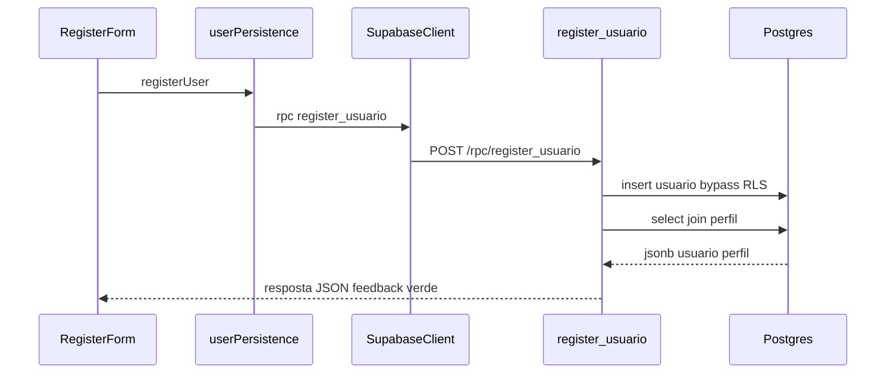

# US116 — Persistência de dados de usuário

Documento de entrega da **US116 — Persistência de Dados de Usuário (Banco de Dados)**.
Descreve o que foi implementado no `ts1-front` e o que foi configurado no Supabase para
que o cadastro pela tela `/register` passe a gravar e ler usuários reais no banco.

---

## Resumo

O formulário de cadastro do portal (em `ts1/ts1-front/src/features/Auth/RegisterForm.tsx`)
antes enviava os dados para um endpoint fictício `http://localhost:3000/register`.
Na versão atual, o mesmo formulário:

1. Chama a RPC **`register_usuario`** no Postgres (função `SECURITY DEFINER`), que valida
   entrada, resolve o perfil, aplica **bcrypt** (`pgcrypto`) na senha e insere em
   `public.usuario`.
2. A RPC devolve **JSON** com os dados públicos do usuário criado e o objeto `perfil`
   aninhado (sem expor `usr_senha_hash`).
3. A UI mostra feedback de sucesso ou erro na própria tela.

**Segurança:** com **RLS ligada** em `perfil` e `usuario`, o papel `anon` não faz mais
`insert`/`select` diretos em `usuario`; apenas `select` em `perfil` ativo e `execute` na
RPC. A `anon key` continua pública no bundle — o endurecimento vem de **RLS + função
controlada**, não de esconder a chave.

**Aplicar SQL no Supabase:** rode o script versionado em
[`sql/rls_rpc_register_usuario.sql`](sql/rls_rpc_register_usuario.sql) no SQL Editor (ou
via `apply_migration` no MCP quando não estiver em modo somente leitura).

---

## Arquivos adicionados ou alterados no repositório

| Caminho | Propósito |
|---------|-----------|
| `ts1/ts1-front/.env.example` | Template de variáveis de ambiente (commitado sem valores) |
| `ts1/ts1-front/.env.local` | Valores reais de `VITE_SUPABASE_URL` e `VITE_SUPABASE_ANON_KEY` — **não commitado**, coberto por `*.local` no `.gitignore` |
| `ts1/ts1-front/package.json` / `package-lock.json` | Inclui a dependência `@supabase/supabase-js` |
| `ts1/ts1-front/src/lib/supabaseClient.ts` | Singleton do client Supabase lendo `import.meta.env` |
| `ts1/ts1-front/src/services/userPersistence.ts` | Serviço de persistência: `hashPassword`, `resolvePerfilId`, `registerUser`, `getUsuarioByEmail` |
| `ts1/ts1-front/src/features/Auth/RegisterForm.tsx` | Passa a usar `registerUser` em vez do `api('/register')` fictício, com feedback de sucesso/erro na UI |

### O que cada peça faz

**`src/lib/supabaseClient.ts`**  
Cria uma única instância do cliente Supabase reaproveitada por toda a aplicação. Lança
erro imediato e claro se as envs não estiverem preenchidas (evita falhas silenciosas).

**`src/services/userPersistence.ts`**  
Chama `supabase.rpc('register_usuario', { ... })` e converte o JSON de retorno em
`Usuario` (sem hash). Mapeia mensagens de erro da função (`DUPLICATE_EMAIL`, etc.) para
textos amigáveis na UI.

**`src/features/Auth/RegisterForm.tsx`**  
Substitui o `console.log` antigo por estados (`idle` / `loading` / `success` / `error`)
e mostra um parágrafo colorido abaixo do botão. Após o sucesso, usa `created.perfil`
retornado pela RPC no feedback (não há mais `select` direto em `usuario` pelo anon).

---

## O que foi feito no Supabase (fora do repositório)

O projeto Supabase (`https://judpxlrpzdnxejtgmlcn.supabase.co`) já tinha o schema do MER
criado via painel. Três ajustes pontuais foram necessários para a US funcionar:

### 1. PKs sem auto-incremento → adicionar `IDENTITY`

As tabelas vieram com `prf_id`, `usr_id`, etc. como `int4 NOT NULL` mas **sem sequence**
nem default. Resultado prático: qualquer `insert` sem informar o ID manualmente falhava
com `null value in column "prf_id" violates not-null constraint`.

Como o código do front (e qualquer outra camada futura) não deve inventar IDs, as PKs
foram convertidas para `GENERATED BY DEFAULT AS IDENTITY`:

```sql
alter table public.perfil           alter column prf_id add generated by default as identity;
alter table public.usuario          alter column usr_id add generated by default as identity;
alter table public.estacao_controle alter column est_id add generated by default as identity;
alter table public.satelite         alter column sat_id add generated by default as identity;
alter table public.canal_comunicacao alter column cnc_id add generated by default as identity;
alter table public.comando          alter column cmd_id add generated by default as identity;
alter table public.comando_parametro alter column cmp_id add generated by default as identity;
alter table public.mensagem         alter column msg_id add generated by default as identity;
alter table public.telemetria       alter column tlm_id add generated by default as identity;
```

A escolha por `IDENTITY` (padrão SQL moderno) em vez de `SERIAL` segue a recomendação
oficial do PostgreSQL 10+.

### 2. Seed mínimo em `public.perfil`

A tabela estava vazia. Os 3 perfis usados pelo dropdown do formulário foram inseridos com
os exatos rótulos apresentados na UI:

```sql
insert into public.perfil (prf_nome, prf_nivel_acesso, prf_descricao, prf_status)
values
  ('Admin',   'ALTO',  'Administrador do sistema',              'ATIVO'),
  ('Usuário', 'BAIXO', 'Usuário operacional',                   'ATIVO'),
  ('Gerente', 'MEDIO', 'Gerente com permissões intermediárias', 'ATIVO');
```

### 3. Endurecimento: RLS + RPC `register_usuario` (substitui RLS desligada no MVP)

O MVP inicial desligava RLS em `perfil` e `usuario`, o que expunha as tabelas a qualquer
cliente com a `anon key`. A mitigação versionada está em
[`sql/rls_rpc_register_usuario.sql`](sql/rls_rpc_register_usuario.sql):

- **RLS ligada** em `perfil` e `usuario`.
- **Policy** em `perfil`: `SELECT` para `anon` e `authenticated` apenas em linhas com
  `prf_status = 'ATIVO'`.
- **Sem policies** em `usuario` para `anon`/`authenticated` ⇒ nega `INSERT`/`SELECT`
  diretos via PostgREST; o cadastro passa pela função **`register_usuario`**
  (`SECURITY DEFINER`, `search_path` fixo `public, extensions`), com validação e
  **bcrypt** em `usr_senha_hash`.
- **`GRANT EXECUTE`** na função para `anon` e `authenticated`.

> **MCP `user-supabase-projeto`:** se `apply_migration` responder *read-only*, aplique o
> SQL manualmente no painel do Supabase e versionamos o arquivo no Git mesmo assim.

---

## Fluxo completo, ponta a ponta



---

## Como rodar localmente

1. `cd ts1/ts1-front`
2. `npm install`
3. Copiar `.env.example` para `.env.local` e preencher:
   ```env
   VITE_SUPABASE_URL=https://judpxlrpzdnxejtgmlcn.supabase.co
   VITE_SUPABASE_ANON_KEY=<anon_key_do_painel_Project_Settings_API>
   ```
4. **Aplicar** [`sql/rls_rpc_register_usuario.sql`](sql/rls_rpc_register_usuario.sql) no
   SQL Editor do Supabase (obrigatório após puxar esta versão do código).
5. `npm run dev` e acessar `http://localhost:5173/register`.
6. Preencher o formulário, submeter e conferir a linha em `public.usuario` pelo Table
   Editor do Supabase.

### Verificação rápida (após aplicar o SQL)

- Cadastro pela tela continua funcionando (RPC retorna sucesso).
- Tentativa de `insert` direto em `usuario` com a **anon key** (REST ou SQL como `anon`)
  deve **falhar** por RLS.
- `select` em `perfil` com anon continua permitido apenas para perfis ativos.

---

## Aderência aos critérios de aceite da US116

| Critério | Onde é atendido |
|----------|-----------------|
| Persistência dos dados de usuário implementada na aplicação | `registerUser` → RPC `register_usuario` em `userPersistence.ts` |
| Salvamento dos dados realizado com sucesso na base de dados | `insert` dentro da função SQL em `public.usuario` + Table Editor |
| Leitura dos dados de usuário funcionando corretamente | JSON retornado pela RPC (usuário + `perfil`) exibido no feedback da UI |
| Estrutura de persistência compatível com o modelo de dados definido | Mesmas colunas MER; `usr_senha_hash` com bcrypt server-side |
| Integração da persistência com a funcionalidade de cadastro validada | `RegisterForm.tsx` consumindo o serviço e exibindo sucesso/erro |

---

## Próximos passos

### Fase B — Supabase Auth + RLS por `auth.uid()` (recomendado)

1. Adicionar coluna `usuario.auth_user_id uuid` referenciando `auth.users(id)`.
2. Fluxo de cadastro: `supabase.auth.signUp` + trigger (ou RPC) que cria linha em
   `public.usuario` já vinculada.
3. Policies em `usuario`: `SELECT`/`UPDATE` apenas onde `auth.uid() = auth_user_id`;
   remover `EXECUTE` público de `register_usuario` se o cadastro deixar de ser aberto.
4. Atualizar [auth.ts](../ts1-front/src/services/auth.ts) e o login para sessão real.

### Governança e ops

- Versionar migrations com **Supabase CLI** no monorepo (além do SQL em `docs/sql/`).
- Rotacionar a senha do Postgres do projeto se ainda não foi feito.
- Revisar **RLS nas demais tabelas** do MER (`comando`, `mensagem`, etc.) para o mesmo
  padrão (default deny + policies explícitas).
