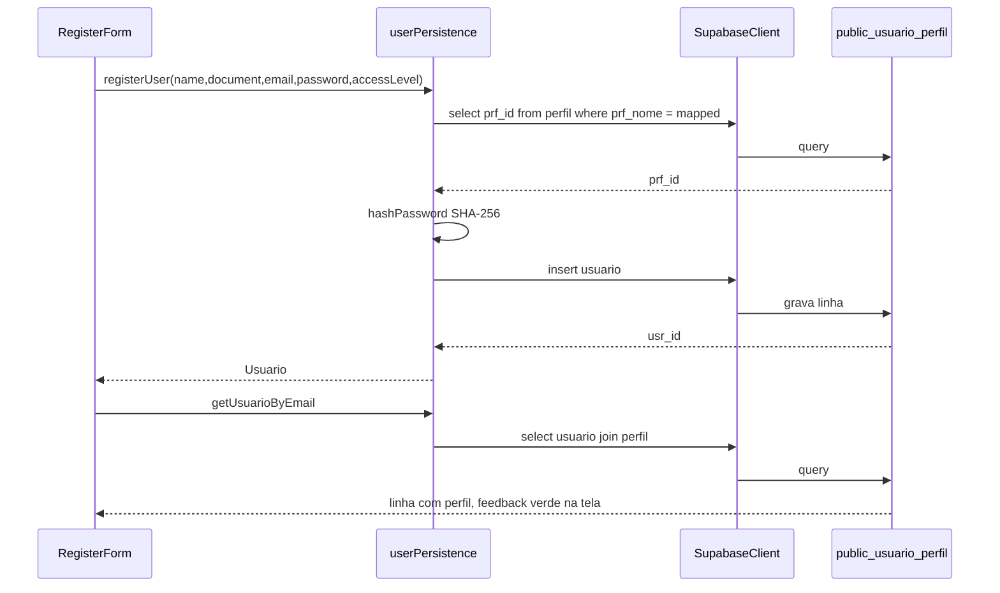

# US116 — Persistência de dados de usuário

Documento de entrega da **US116 — Persistência de Dados de Usuário (Banco de Dados)**.
Descreve o que foi implementado no `ts1-front` e o que foi configurado no Supabase para
que o cadastro pela tela `/register` passe a gravar e ler usuários reais no banco.

---

## Resumo

O formulário de cadastro do portal (em `ts1/ts1-front/src/features/Auth/RegisterForm.tsx`)
antes enviava os dados para um endpoint fictício `http://localhost:3000/register`.
Agora, o mesmo formulário:

1. Resolve o `prf_id` consultando a tabela `public.perfil`.
2. Calcula o hash da senha no browser (SHA-256).
3. Faz `insert` em `public.usuario`.
4. Faz um `select` imediato por `usr_email` para comprovar a leitura do dado recém gravado.
5. Mostra feedback de sucesso ou erro na própria tela.

Nenhum backend intermediário foi criado — a escrita e a leitura vão direto no Supabase
usando a `anon key`, o que atende os critérios de aceite da US116 sem abrir o escopo de
US futuras (autenticação/Supabase Auth, RLS, migrations versionadas).

---

## Arquivos adicionados ou alterados no repositório

| Caminho | Propósito |
|---------|-----------|
| `ts1/ts1-front/.env.example` | Template de variáveis de ambiente (commitado sem valores) |
| `ts1/ts1-front/.env.local` | Valores reais de `VITE_SUPABASE_URL` e `VITE_SUPABASE_ANON_KEY` — **não commitado**, coberto por `*.local` no `.gitignore` |
| `ts1/ts1-front/package.json` / `package-lock.json` | Inclui a dependência `@supabase/supabase-js` |
| `ts1/ts1-front/src/lib/supabaseClient.ts` | Singleton do client Supabase lendo `import.meta.env` |
| `ts1/ts1-front/src/services/userPersistence.ts` | Serviço de persistência: `hashPassword`, `resolvePerfilId`, `registerUser`, `getUsuarioByEmail` |
| `ts1/ts1-front/src/features/Auth/RegisterForm.tsx` | Passa a usar `registerUser` em vez do `api('/register')` fictício, com feedback de sucesso/erro na UI |

### O que cada peça faz

**`src/lib/supabaseClient.ts`**  
Cria uma única instância do cliente Supabase reaproveitada por toda a aplicação. Lança
erro imediato e claro se as envs não estiverem preenchidas (evita falhas silenciosas).

**`src/services/userPersistence.ts`**  
Centraliza a regra da US116. O mapeamento `PERFIL_NOME_POR_ACCESS_LEVEL` traduz o `value`
do `<select>` do formulário (`admin` / `user` / `manager`) para o `prf_nome` exato que
existe na tabela (`Admin` / `Usuário` / `Gerente`), assim o acoplamento entre UI e banco
fica explícito em um só lugar.

- `hashPassword` — usa `crypto.subtle.digest('SHA-256', ...)`, API nativa do navegador.
  Casa com a coluna `usr_senha_hash` do MER e evita armazenar senha em texto puro.
- `resolvePerfilId` — faz `select prf_id from perfil where prf_nome = ?`; se o perfil
  não existir no banco, lança um erro amigável.
- `registerUser` — monta o `insert` em `usuario` com `usr_nome`, `usr_email`, `usr_login`
  (recebe o `document`), `usr_senha_hash`, `prf_id` e `usr_status = 'ATIVO'`.
  Trata `23505` (unique_violation) com mensagem legível.
- `getUsuarioByEmail` — `select('*, perfil(*)').eq('usr_email', ...)` para provar o
  critério de leitura da US.

**`src/features/Auth/RegisterForm.tsx`**  
Substitui o `console.log` antigo por estados (`idle` / `loading` / `success` / `error`)
e mostra um parágrafo colorido abaixo do botão. Após o sucesso, chama
`getUsuarioByEmail` como evidência imediata de que a leitura funciona.

---

## O que foi feito no Supabase (fora do repositório)

O projeto Supabase (`https://judpxlrpzdnxejtgmlcn.supabase.co`) já tinha o schema do MER
criado via painel. Três ajustes pontuais foram necessários para a US funcionar:

### 1. PKs sem auto-incremento → adicionar `IDENTITY`

As tabelas vieram com `prf_id`, `usr_id`, etc. como `int4 NOT NULL` mas **sem sequence**
nem default. Resultado prático: qualquer `insert` sem informar o ID manualmente falhava
com `null value in column "prf_id" violates not-null constraint`.

Como o código do front (e qualquer outra camada futura) não deve inventar IDs, as PKs
foram convertidas para `GENERATED BY DEFAULT AS IDENTITY`:

```sql
alter table public.perfil           alter column prf_id add generated by default as identity;
alter table public.usuario          alter column usr_id add generated by default as identity;
alter table public.estacao_controle alter column est_id add generated by default as identity;
alter table public.satelite         alter column sat_id add generated by default as identity;
alter table public.canal_comunicacao alter column cnc_id add generated by default as identity;
alter table public.comando          alter column cmd_id add generated by default as identity;
alter table public.comando_parametro alter column cmp_id add generated by default as identity;
alter table public.mensagem         alter column msg_id add generated by default as identity;
alter table public.telemetria       alter column tlm_id add generated by default as identity;
```

A escolha por `IDENTITY` (padrão SQL moderno) em vez de `SERIAL` segue a recomendação
oficial do PostgreSQL 10+.

### 2. Seed mínimo em `public.perfil`

A tabela estava vazia. Os 3 perfis usados pelo dropdown do formulário foram inseridos com
os exatos rótulos apresentados na UI:

```sql
insert into public.perfil (prf_nome, prf_nivel_acesso, prf_descricao, prf_status)
values
  ('Admin',   'ALTO',  'Administrador do sistema',              'ATIVO'),
  ('Usuário', 'BAIXO', 'Usuário operacional',                   'ATIVO'),
  ('Gerente', 'MEDIO', 'Gerente com permissões intermediárias', 'ATIVO');
```

### 3. Desligar RLS em `perfil` e `usuario` (escopo **apenas** desta US)

Tabelas criadas pelo painel do Supabase vêm com **Row Level Security habilitada por
padrão**. Sem nenhuma policy, a `anon key` (chave pública usada pelo front) **não recebe
erro**, mas enxerga a tabela vazia — o que produzia o sintoma “Perfil 'Admin' não
encontrado em public.perfil” mesmo com os dados presentes no banco.

A US116 pede apenas o fluxo básico de persistência e explicitamente deixa policies para
uma US futura. Portanto, para desbloquear a entrega, a RLS foi desligada nas duas tabelas
envolvidas:

```sql
alter table public.perfil  disable row level security;
alter table public.usuario disable row level security;
```

**Implicação de segurança consciente:** com a `anon key` vazando (por estar no bundle do
front), qualquer pessoa consegue ler e escrever nessas tabelas diretamente no Supabase.
Aceitável para o MVP da US116, **inaceitável em produção**. Próximo passo obrigatório é
reativar a RLS e escrever policies (ver seção “Próximos passos”).

---

## Fluxo completo, ponta a ponta



---

## Como rodar localmente

1. `cd ts1/ts1-front`
2. `npm install`
3. Copiar `.env.example` para `.env.local` e preencher:
   ```env
   VITE_SUPABASE_URL=https://judpxlrpzdnxejtgmlcn.supabase.co
   VITE_SUPABASE_ANON_KEY=<anon_key_do_painel_Project_Settings_API>
   ```
4. `npm run dev` e acessar `http://localhost:5173/register`.
5. Preencher o formulário, submeter e conferir a linha em `public.usuario` pelo Table
   Editor do Supabase.

---

## Aderência aos critérios de aceite da US116

| Critério | Onde é atendido |
|----------|-----------------|
| Persistência dos dados de usuário implementada na aplicação | `registerUser` em `userPersistence.ts` |
| Salvamento dos dados realizado com sucesso na base de dados | `insert` em `public.usuario` + verificação no Table Editor |
| Leitura dos dados de usuário funcionando corretamente | `getUsuarioByEmail` chamado após o insert e refletido na UI |
| Estrutura de persistência compatível com o modelo de dados definido | Colunas `usr_nome`, `usr_email`, `usr_login`, `usr_senha_hash`, `prf_id`, `usr_status` alinhadas ao dicionário em [docs/mer/README.md](mer/README.md) |
| Integração da persistência com a funcionalidade de cadastro validada | `RegisterForm.tsx` consumindo o serviço e exibindo sucesso/erro |

---

## Próximos passos (fora desta US)

- Reativar RLS em `perfil` e `usuario` e escrever policies mínimas (leitura de `perfil`
  para o formulário, insert/select em `usuario` restritos ao próprio usuário autenticado).
- Migrar autenticação para **Supabase Auth** (`signUp` / `signInWithPassword`) e trocar
  o mock atual em `src/services/auth.ts`.
- Versionar o schema com pasta `supabase/` + migrations da CLI do Supabase, para que os
  `ALTER TABLE ... IDENTITY` e os seeds fiquem rastreados no repositório.
- Rotacionar a senha do Postgres do projeto (circulou em chat durante o desenvolvimento).
